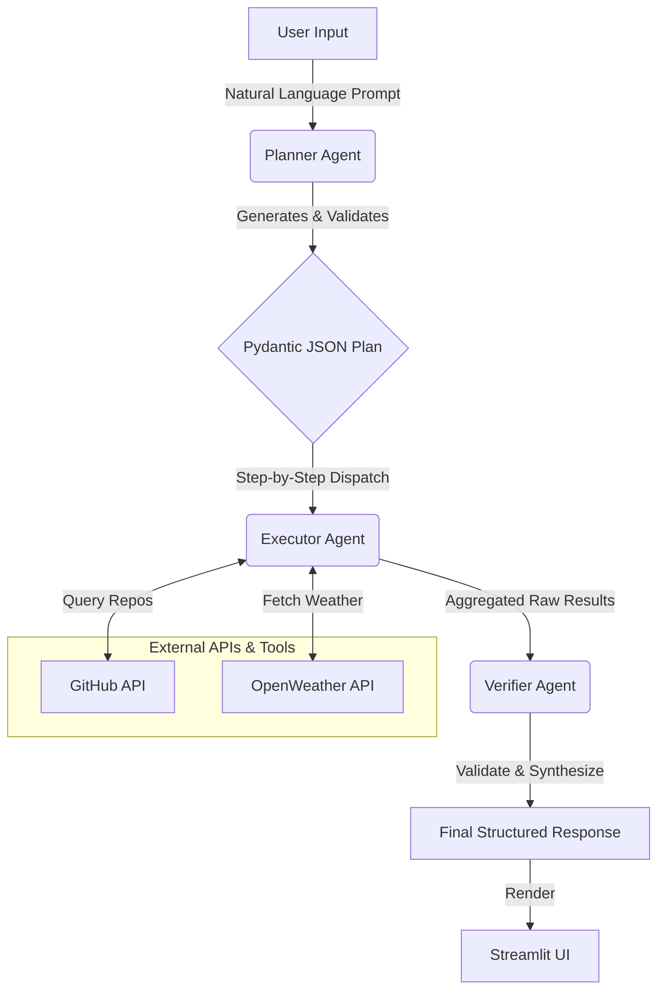

# AI Operations Assistant

[](https://aiopsassistant-dgtfa77vc4xjew7s8wgipz.streamlit.app/)
[](https://www.python.org/)
[](https://ai.google.dev/)
[](https://www.langchain.com/)
[](https://opensource.org/licenses/MIT)

> An autonomous, multi-agent AI operations workflow that transforms natural language tasks into structured execution plans, orchestrates real-world API calls, and verifies the output into a clean, validated response.

---

## Overview

**AI Operations Assistant** is an agentic AI system designed to solve complex user tasks by breaking them down into actionable steps. Instead of relying on a single prompt-response cycle, it leverages a specialized three-tier agent architecture:

1. **Planner Agent** — Parses user goals and generates a strict, validated JSON execution plan.
2. **Executor Agent** — Routes and executes plan steps against integrated real-world APIs.
3. **Verifier Agent** — Inspects execution outputs, corrects formatting anomalies, and structures the final response.

---

## Live Demo

Experience the application live in your browser:
[Launch AI Operations Assistant](https://aiopsassistant-dgtfa77vc4xjew7s8wgipz.streamlit.app/)

---

## Key Features

- **Multi-Agent Orchestration**: Modular Planner -> Executor -> Verifier pipeline.
- **Strict Structured Outputs**: JSON schema enforcement using **Pydantic** models with fallback parsing.
- **Real-World Tool Integrations**:
  - **GitHub Search API**: Searches top-starred repositories, descriptions, and URLs.
  - **OpenWeatherMap API**: Retrieves live weather conditions and temperatures for any global city.
- **Interactive Web Interface**: Streamlit UI displaying the real-time plan, API responses, and validated final answer.
- **Powered by Gemini 1.5 Flash**: Fast reasoning and low-latency API interactions.

---

## Architecture & Workflow



### Agent Roles

| Agent | Responsibility | Core Technology |
| :--- | :--- | :--- |
| **Planner Agent** | Deconstructs user tasks into deterministic JSON action steps | `gemini-1.5-flash`, `Pydantic` |
| **Executor Agent** | Dispatches tool calls sequentially and aggregates API payloads | `requests`, REST APIs |
| **Verifier Agent** | Validates results against the original user prompt for completeness | `gemini-1.5-flash` |


---

## Project Structure

```text
ai_ops_assistant/
│
├── agents/
│   ├── planner.py       # Planner Agent: creates Pydantic-validated JSON plans
│   ├── executor.py      # Executor Agent: invokes corresponding tools
│   └── verifier.py      # Verifier Agent: synthesizes & validates final response
│
├── llm/
│   └── gemini.py        # Google Gemini LLM client setup (LangChain)
│
├── tools/
│   ├── github_tool.py   # GitHub Search REST API integration
│   └── weather_tool.py  # OpenWeatherMap Current Weather API integration
│
├── .env                 # Environment variables (API keys - gitignored)
├── main.py              # Streamlit Web UI application
├── requirements.txt     # Python project dependencies
├── setup.txt            # Quick environment setup reference
└── README.md            # Project documentation
```

---

## Tech Stack

- **Frontend & App Framework**: [Streamlit](https://streamlit.io/)
- **LLM Orchestration**: [LangChain](https://www.langchain.com/) / [LangGraph](https://www.langchain.com/langgraph)
- **Model Provider**: [Google Gemini (gemini-2.5-flash)](https://ai.google.dev/)
- **Data Validation**: [Pydantic v2](https://docs.pydantic.dev/)
- **External APIs**: [GitHub REST API](https://docs.github.com/en/rest), [OpenWeatherMap API](https://openweathermap.org/api)
- **Runtime**: Python 3.10+

---

## Installation & Setup

### 1. Clone the Repository
```bash
git clone https://github.com/rishabh6900/ai_ops_assistant.git
cd ai_ops_assistant
```

### 2. Set Up a Virtual Environment

**Using Conda (Recommended):**
```bash
conda create -n ai_ops_assistant python=3.10 -y
conda activate ai_ops_assistant
```

**Or using Python `venv`:**
```bash
python -m venv venv
# On Windows:
.\venv\Scripts\activate
# On macOS/Linux:
source venv/bin/activate
```

### 3. Install Dependencies
```bash
pip install -r requirements.txt
```

### 4. Configure Environment Variables
Create a `.env` file in the root directory:
```bash
touch .env
```

Add your API credentials:
```ini
# Google Gemini API Key (https://aistudio.google.com/)
GOOGLE_API_KEY="your-google-api-key"

# GitHub Personal Access Token (https://github.com/settings/tokens)
GITHUB_TOKEN="your-github-token"

# OpenWeatherMap API Key (https://home.openweathermap.org/api_keys)
OPENWEATHER_API_KEY="your-openweather-api-key"
```

---

## Running the Application

Start the Streamlit development server:

```bash
python -m streamlit run main.py
```

Once running, access the web app at:
**`http://localhost:8501`**

---

## Example Prompts & Workflows

### Example Prompt:
> *"Find the top GitHub repositories related to AI agents and tell me the current weather in Delhi."*

#### 1. Generated Plan (Planner Agent)
```json
{
  "steps": [
    {
      "step": "Search GitHub for repositories related to AI agents.",
      "tool": "github_search",
      "input": "AI agents"
    },
    {
      "step": "Look up the current weather in Delhi.",
      "tool": "weather_lookup",
      "input": "Delhi"
    }
  ]
}
```

#### 2. Execution Results (Executor Agent)
- Calls `github_search` with query `"AI agents"` -> Fetches repository names, stars, descriptions, and URLs.
- Calls `weather_lookup` with city `"Delhi"` -> Fetches temperature and weather condition.

#### 3. Verified Output (Verifier Agent)
A clean, synthesized summary answering all aspects of the user query.

### More Sample Queries to Try:
- *"Find top 5 Python repositories for machine learning and get the weather in Mumbai."*
- *"Show me popular data science GitHub repositories and the current weather in San Francisco."*
- *"Find highly starred beginner Python repositories and check the weather in London."*

---

## License

This project is licensed under the [MIT License](LICENSE).